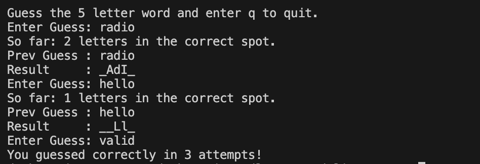

# Wordle Command Line Game

This is a command-line version of the popular word-guessing game Wordle. The game selects a random word from a list of valid words, and the player has to guess the word within a limited number of attempts.

## Features

- **Random Word Selection**: The game selects a random word from a predefined list of valid words.
- **Case Insensitivity**: The game is case-insensitive, so guesses can be entered in uppercase or lowercase.
- **Feedback on Guesses**: The game provides feedback on the number of correct letters and their positions.
- **Valid Word Check**: The game checks if the guessed word is a valid word from the list before proceeding.
- **Limited Attempts**: The player has a maximum of 6 attempts to guess the word correctly.
- **Quit Option**: The player can quit the game by entering 'q' as their guess.

## How It Works

1. The game selects a random word from the `valid-wordle-words.txt` file.
2. The player is prompted to guess the word.
3. The player's guess is checked for validity against the list of valid words.
4. If the guess is valid and matches the length of the selected word, the game checks how many letters are in the correct position.
5. The game provides feedback on the number of correct letters and their positions.
6. The player has a maximum of 6 attempts to guess the word correctly.
7. If the player guesses the word correctly within the allowed attempts, they win. Otherwise, the game reveals the correct word after all attempts are used.

## How to Use

1. Clone the repository to your local machine:
    ```sh
    git clone https://github.com/deskenazi/wordle-command-line.git
    ```

2. Navigate to the project directory:
    ```sh
    cd wordle-command-line
    ```

3. Compile the code using a C++ compiler:
    ```sh
    g++ -o wordle wordle.cpp
    ```

4. Run the game:
    ```sh
    ./wordle
    ```

5. Follow the on-screen instructions to play the game.

## Example Output



## File Structure

- `wordle.cpp`: The main game logic.
- `word-provider.h`: Contains the `WordProvider` class that provides methods to get a random word and check for valid words.
- `valid-wordle-words.txt`: A text file containing a list of valid words for the game.

## Dependencies

- C++ Standard Library

## License

This project is licensed under the MIT License. See the [LICENSE](LICENSE) file for details.

## Contributing

Contributions are welcome! Please open an issue or submit a pull request for any improvements or bug fixes.

